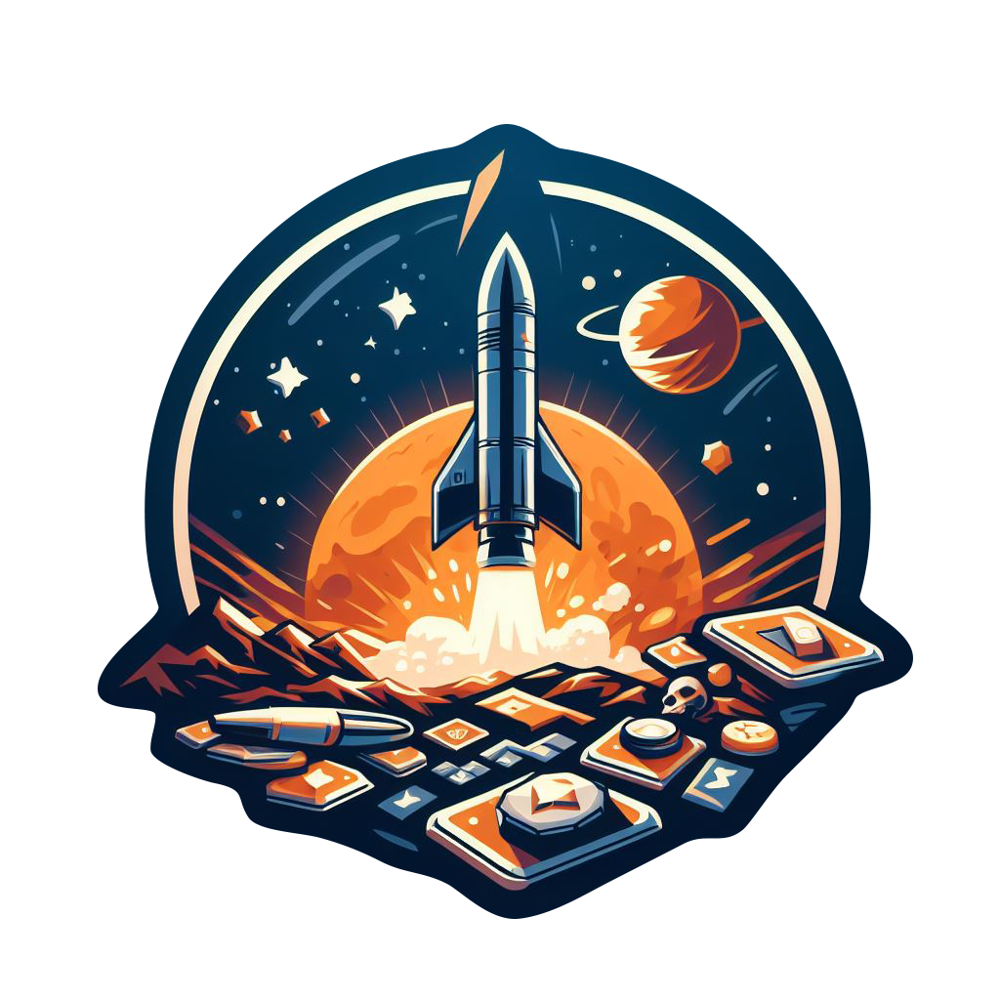

# Saturnian Settlers
2023 NASA Space Apps Challenge entry for [Titan City, 3023](https://www.spaceappschallenge.org/2023/challenges/titan-city-3023/)

[Saturnarian Settlers](https://www.spaceappschallenge.org/2023/find-a-team/saturnian-settlers/)

Saturnarian Settlers is our solution entry for the 2023 NASA Space Apps Challenge, [Titan City, 3023](https://www.spaceappschallenge.org/2023/challenges/titan-city-3023/). The goal of this challenge is to create an educational game that teaches the challenges of exploring and inhabiting Saturn's largest moon, [Titan](https://science.nasa.gov/saturn/moons/titan/facts/).

## MISSION BRIEF

After much planning and preparation, it is finally time for the Titan 3023 crew, the Saturnian Settlers, to execute the mission. The Settlers are going to Titan, Saturn's icy moon! They will establish the first human settlement and advance society through exploration. Even though Titan is considered one of the best targets for human settlement, it comes with some serious challenges that must be addressed.

* Gravity is only 1/7 Earth normal.
* The atmosphere is toxic. It is mostly nitrogen with some methane.
* The temperature is -179℃ (-290℉). That is way below freezing!

Each round should bring the settlement closer to sustainable independence but it is up to the Saturnian Settler’s leaders to decide what choices are made for each round to sustain human life on the Saturnian satellite. 

Space exploration is controlled by a global alliance called the Consolidated Space Agencies of Earth (CSEA). CSEA derives its mission priorities and funding from its member states They have seeded the settlement mission by launching a series of rockets containing the essential settlement structures needed to bootstrap the settlement. They have also secured funding for seven supply missions to provide critical resources and additional settlers to the settlement.

Our settlers are about to embark on the journey of a lifetime to Titan where they intend to establish the first human settlement beyond the asteroid belt! Will they succeed? Their fate lies in your hands and in the choices you make on production and resource allocation both on Earth and within the settlement. Good luck! 
          
## OBJECTIVE
Saturnian Settlers is a turn-based space mission simulation game designed for 1-4 players. The goal of the game is to create a self-sustainable settlement. Our goal for players is to provide an entertaining experience while educating them on the challenges faced by settlers trying to establish a self-sustainable settlement on a distant moon or planet. The game is played over a number of rounds.

The game is set in the far future. Humanity has overcome many of the challenges they faced in the early industrial and technology ages. Our settlers live in a time where science and technology have advanced sufficiently to enable discovery and exploration of the solar system. Society on Earth and the inner planets are still challenged by the issues we face today where politics, personalities, and nature keep life interesting.

## Team
* Ann Adair
* Ashle Thompson
* Bill Shaw
* Jon Adair

## Play Video

## Credits

Game Design by Jon Adair, Bill Shaw, Ashle Thompson, and Ann Adair. 

This game was produced as part of the 2023 NASA Space Apps Challenge. Our thanks go out to the global organizing team, the local sponsors and organizers for the Tampa Event, Tampa Hackerspace for providing the community and resources needed to pull this all together, and to our competitors who helped us raise the bar to accomplish everything in less than 48 hours.

### 3D Models
Mining Rig by Tezca https://www.thingiverse.com/thing:4792433
Random building by Noobie3Dmaker https://www.thingiverse.com/thing:5886121
Most buildings from the Settlers of Mars collection by AntonKossmann https://www.thingiverse.com/thing:3581526

### Artwork
Logo and building imagery generated by Bing Image Creator Powered by Dall-E3
Fuel Resource image by macrovector on Freepik

## Additional Resources
* [What You Need to Know About Saturn's Moon Titan (video) ](https://www.youtube.com/watch?v=lr4r70DWShk)
* [Building Blocks for Surviving Titan](https://svs.gsfc.nasa.gov/12736x)
* [NASA’s Dragonfly Will Fly Around Titan Looking for Origins, Signs of Life](https://www.nasa.gov/news-release/nasas-dragonfly-will-fly-around-titan-looking-for-origins-signs-of-life/)
